# Virtual Fisio - Envelhecer ficou no passado
Uma solução capaz de realizar o rastreamento de pontos de referência, e micro-expressões de forma tanto assíncrona (por exemplo, submetendo um vídeo a solução) e/ou em tempo real (por exemplo, a aplicação informa o feedback de acertos/erros ao usuário se exercitando em tempo real). As expressões do usuário são capturadas para registrar possíveis incômodos durante os exercícios, bem como a evolução ao longo do tempo (parou de sentir os incômodos).

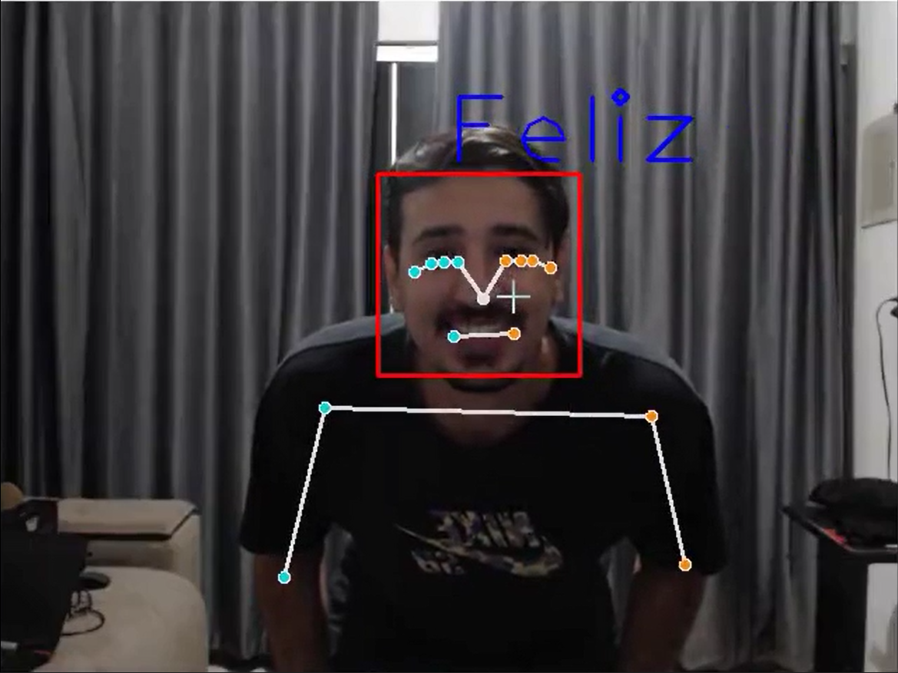</img>
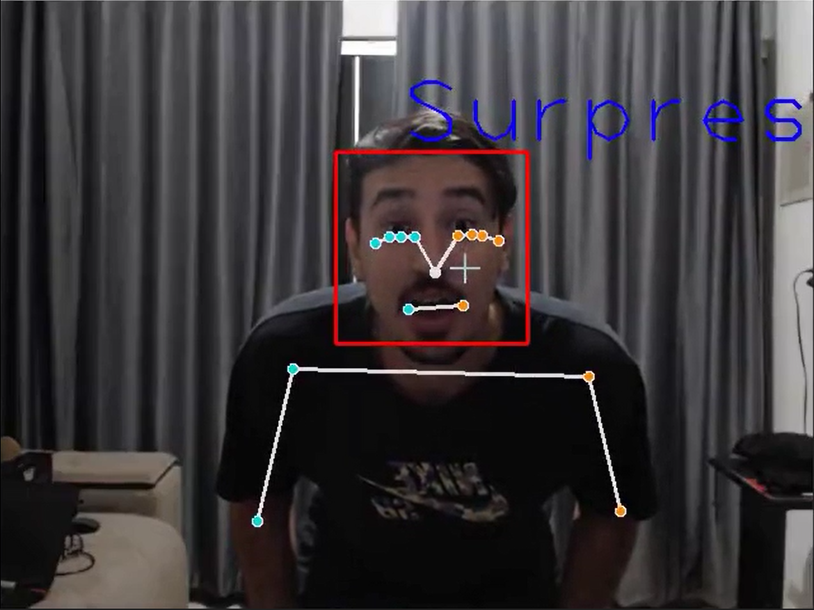</img>
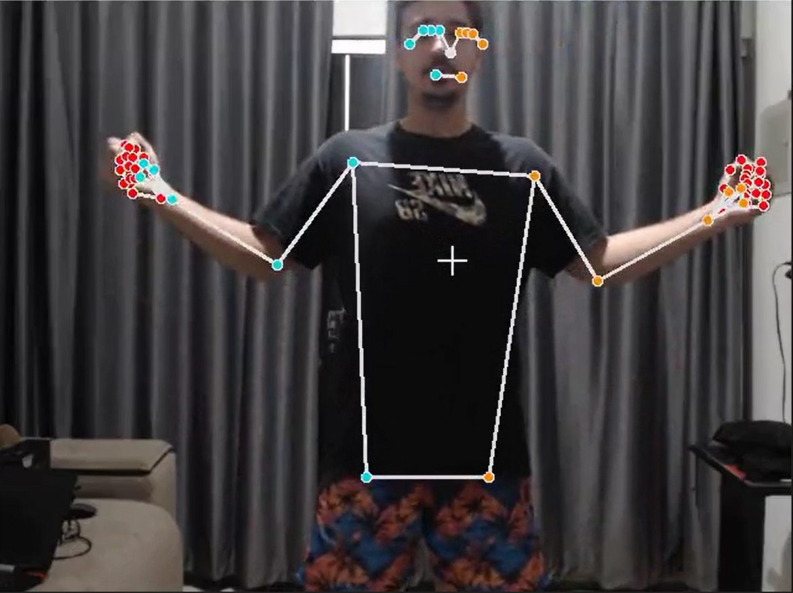</img>
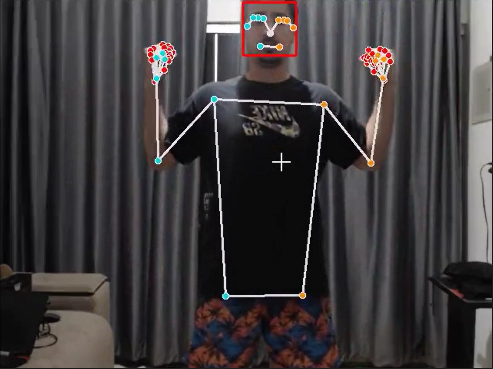</img>
</img>
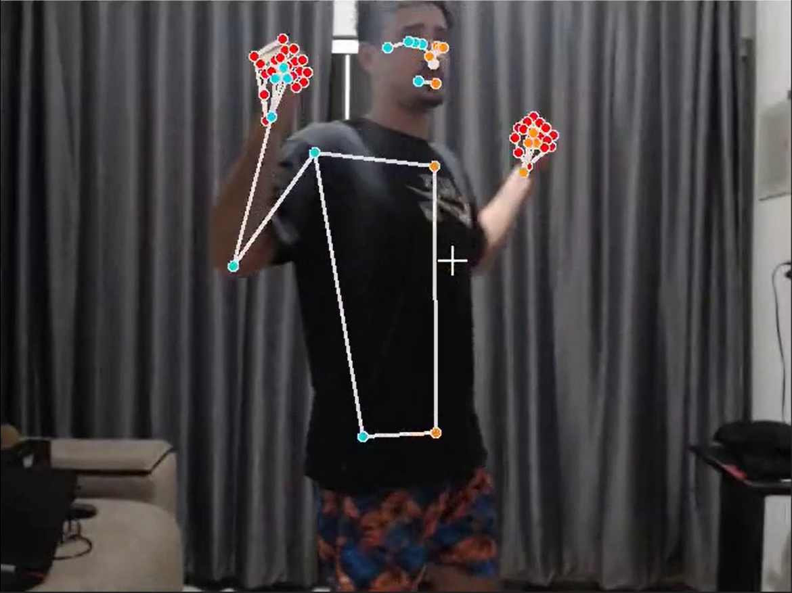</img>
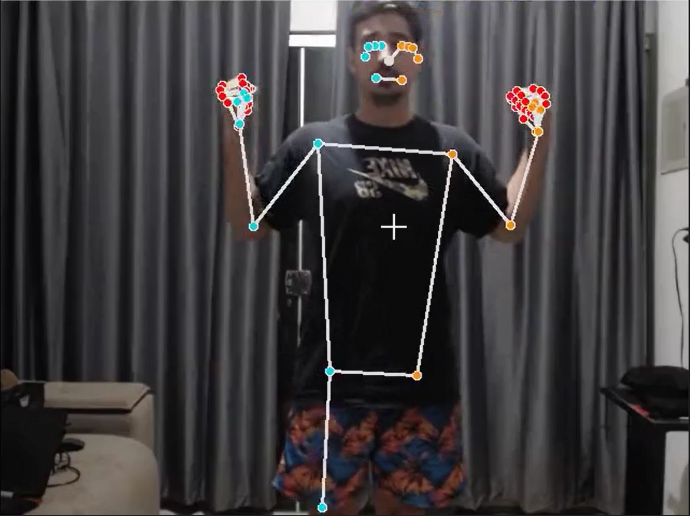</img>
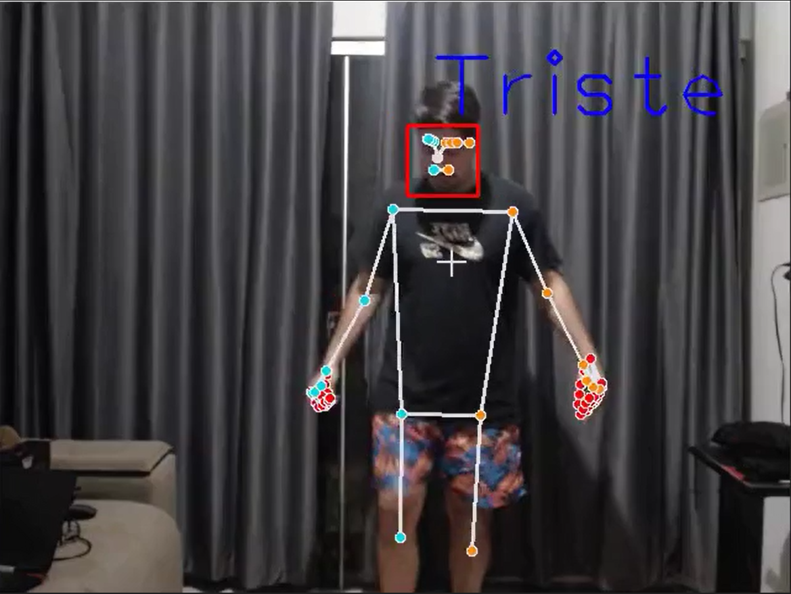</img>
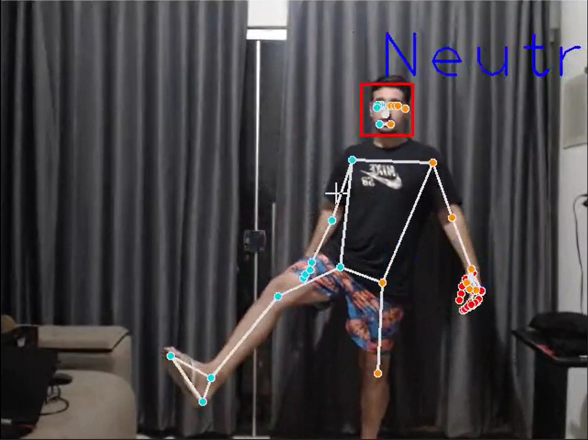</img>
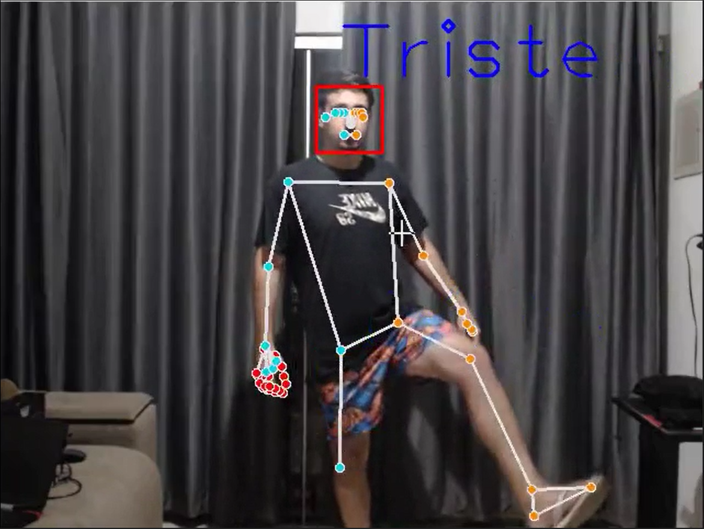</img>
</img>
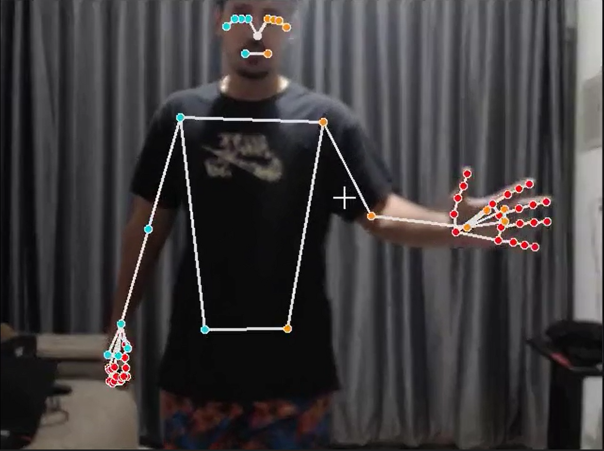</img>
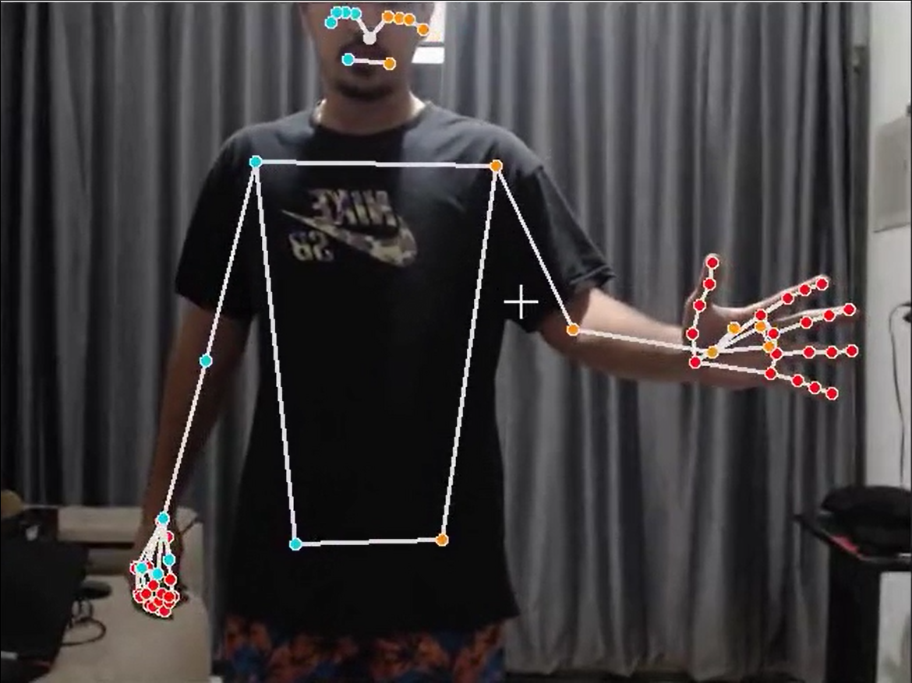</img>
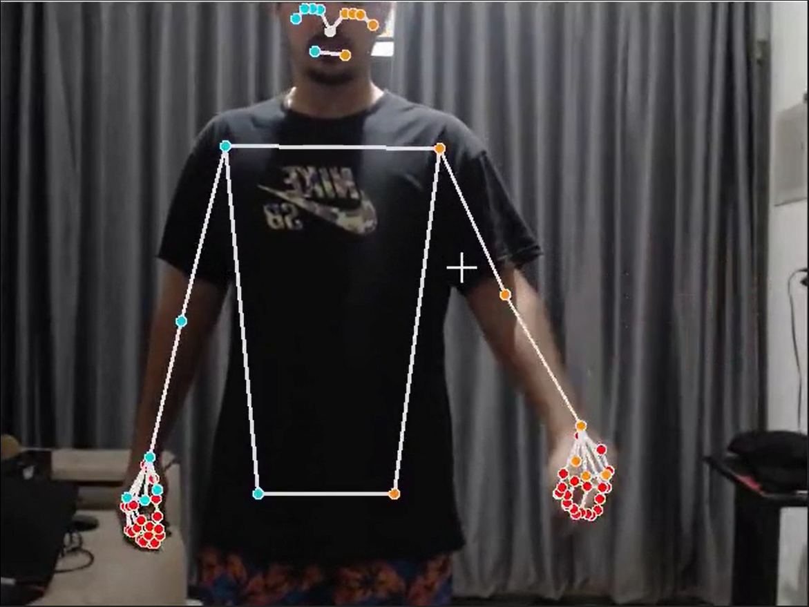</img>

## Equipe 3:

 1. Caio K.
 2. Luís Henrique Picinin Jandre
 3. Gabriel Marioto
 4. Arthur Monti
 5. Bruno M.

### Plano de negócio

### Dependências
 - pip install opencv-contrib-python
 - pip install mediapipe
 - pip install tensorflow
 - pip install streamlit

### Rodando o projeto
Após instalar as dependências execute 

> streamlit run main.py

